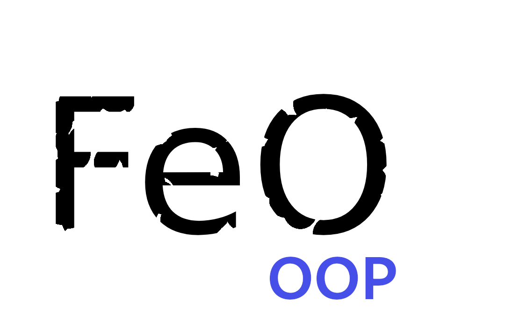

# [FeO OOP Engine](https://github.com/littleTitan/feo-oop-engine) <!-- (https://feo-oop-engine.rs) -->

[](https://crates.io/crates/feo-oop-engine)
[](https://docs.rs/feo-oop-engine)
[](https://github.com/littleTitan/feo-oop-engine/actions?query=workflow%3ARust)

see also: [feo-math](https://github.com/littleTitan/feo-math)

## Description

> The FeO OOP engine is a library I created to help me learn about 3D engines. This is my own undertaking.

This project is composed of two parts. [feo-math](https://github.com/littleTitan/feo-math), the math boilerplate; and the feo-oop-engine. The engine is built on the [vulkano](https://vulkano.rs) framework. This program is designed to facilitate 3D application development. Please note however that this program has its own unique [workflow](##workflow). Features of the engine include [scripts](###scripts), object oriented programming (or OOP for short), textures, materials, lights, game objects, and obj and mtl processing.

## Timeline
This project is the result of a seemingly simple question: how do you project a 3D object onto a 2D surface. Then it became how do you project a 3D object onto a 2D surface using perspective projection. Then it evolved into how do you efficiently project a 3D object onto a 2D surface using perspective projection. At the time I started this project I was very new to rust. Currently I feel like I could take on any Rust challenge thrown at me. The project timeline is convoluted for many reasons. I basically gave up using git after losing 2 computers (I am once again using the first), a result of a stupid mistake I have long since fixed. I was forced after these incidents to resort to old backups on an external drive(this was very disorienting). 

## Workflow
This library allows for the creation of scripts that govern the behavior of game_objects. Once the run function is called, it takes control of the thread until the window is closed. During this time it is still possible to create new game-objects and scripts that can be added to the scene.

### Why Scripts?
The simple answer is I tried something and liked the way it turned out. OOP is not something that Rust is known for and neither is scripting, given these two facts and given my love for challenging myself I decided to try and implement both. I intend to release an ECS version of this project but I wanted to provide this as an option because personally, with my Java, C#, and Unity background, I feel it is a bit more intuitive, although granted slower.

## Compatibility

|  OS     | Compatible         |
| :-----: | :----------------: |
| Windows | :x:                |
| Linux   | :heavy_check_mark: |
| OSX     | :heavy_check_mark: |

See issue [#1](/../../issues/1) for Windows

## Usage
Using the engine is very straight forward.

### Building the Scene
First create a new scene.
```rust
let scene = Scene::new(None); // Worldspace is not yet a fully completed feature
```
This is where all of your game-objects will directly or indirectly exist on. 

### Initialize the Engine With the Scene
To create an engine use the `FeoEngine::init(scene, specify_hardware)`. This will create a feo_engine object.
```rust
let mut engine = FeoEngine::init(scene, Some(1)); /* Here I am using Some(1) to choose the first hardware that can support the engine. If you do not know what you want to use use None and you will be prompted with a list of the options. */
```

### Build Objects
To build objects use the `::new()` constructor for the object you wish to build. You might want to build a light and a camera to be able to see the scene.
```rust
// Obj's are one type of GameObject
let obj = Obj::from_obj(
   Some("cube"), 
   "assets/standard-assets/models/shapes/cube.obj",
   None,
   None,
   None,
   None,
   true,
   engine.globals.clone(),
   None // The scripts go here
);
```

### Pass Objects to Scene
Use the `add_child()` function to add the object you created to the scene within the engine.
```rust
engine.scene.write().unwrap().add_child(obj.unwrap());
```

### Running the Engine
When all the game_objects have been created you can use the run() function of feo_engine to start the engine.
```rust
engine.run()
```

# License 
```LICENSE
MIT License

Copyright (c) 2021 Lucas Ballmer

Permission is hereby granted, free of charge, to any person obtaining a copy
of this software and associated documentation files (the "Software"), to deal
in the Software without restriction, including without limitation the rights
to use, copy, modify, merge, publish, distribute, sublicense, and/or sell
copies of the Software, and to permit persons to whom the Software is
furnished to do so, subject to the following conditions:

The above copyright notice and this permission notice shall be included in all
copies or substantial portions of the Software.

THE SOFTWARE IS PROVIDED "AS IS", WITHOUT WARRANTY OF ANY KIND, EXPRESS OR
IMPLIED, INCLUDING BUT NOT LIMITED TO THE WARRANTIES OF MERCHANTABILITY,
FITNESS FOR A PARTICULAR PURPOSE AND NONINFRINGEMENT. IN NO EVENT SHALL THE
AUTHORS OR COPYRIGHT HOLDERS BE LIABLE FOR ANY CLAIM, DAMAGES OR OTHER
LIABILITY, WHETHER IN AN ACTION OF CONTRACT, TORT OR OTHERWISE, ARISING FROM,
OUT OF OR IN CONNECTION WITH THE SOFTWARE OR THE USE OR OTHER DEALINGS IN THE
SOFTWARE.
```